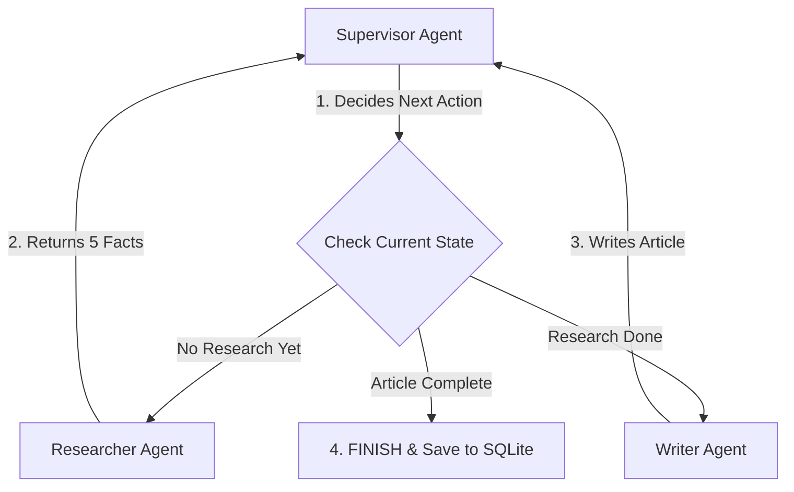

Here is the **complete `README.md` for `langgraph-content-orchestrator`** in one single copyable block:

***

# 🎼 LangGraph Content Orchestrator (`langgraph-content-orchestrator`)

An autonomous multi-agent content generation system built with **LangGraph**, **LangChain**, and local AI (**Ollama `llama2`**). This project demonstrates an orchestrated workflow where a **Supervisor AI** coordinates a **Researcher AI** and a **Writer AI** to create factual articles with built-in SQLite memory persistence.

---

## 📌 How the Team Works (Workflow Diagram)

---

## 🤖 Meet the AI Agents

| Agent Name | Role | What It Actually Does |
|---|---|---|
| **Supervisor** | Orchestrator & Manager | Evaluates the current state and directs whether to run the Researcher, Writer, or finish. |
| **Researcher** | Fact Finder | Queries `llama2` to generate 5 short factual bullet points about the user's topic. |
| **Writer** | Content Creator | Takes the 5 facts from the Researcher and writes a structured 150–200 word article. |

---

## 📂 Repository File Breakdown

- **`main.py`**: Primary Python script containing the LangGraph state graph, node definitions, and execution flow.
- **`checkpoints.db`**: SQLite database file used by `SqliteSaver` to record state memory at every step.
- **`run_log.txt`**: Live execution log showing a real test run on the topic *"what is the css"*.
- **`task7.png`**: Diagram image showing the state machine graph layout.
- **`README.md`**: Technical project documentation.

---

## 🛠️ Simple Technology Summary

| Component | Tool Used | What It Does |
|---|---|---|
| **Graph Framework** | LangGraph (`v0.1.23`) | Manages conditional state routing and agent node execution |
| **Memory Saver** | `SqliteSaver` (SQLite) | Saves state checkpoints to `checkpoints.db` for step-by-step persistence |
| **AI Brain / Model** | Ollama (`llama2`) | Local LLM running with `temperature=0` for consistent factual outputs |

